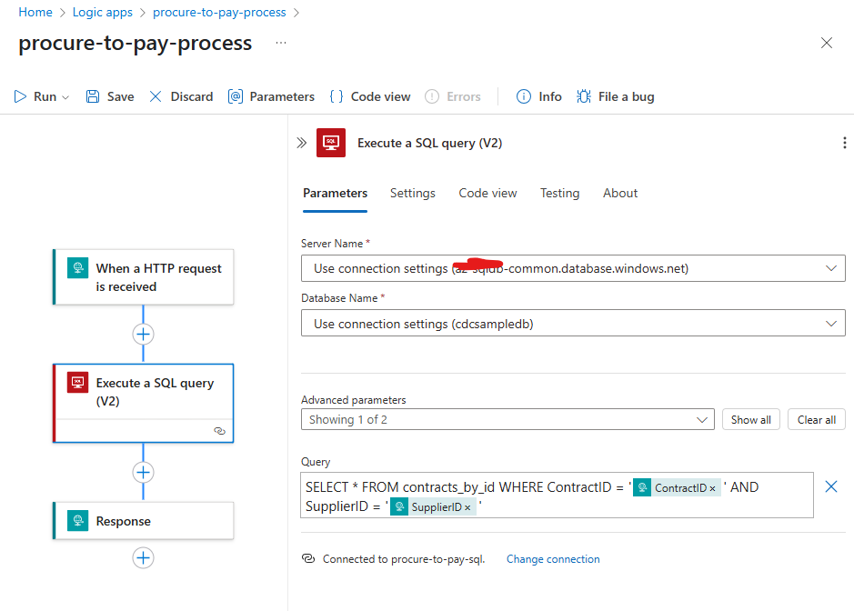
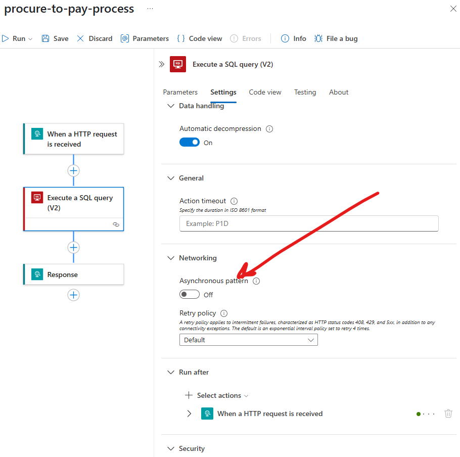
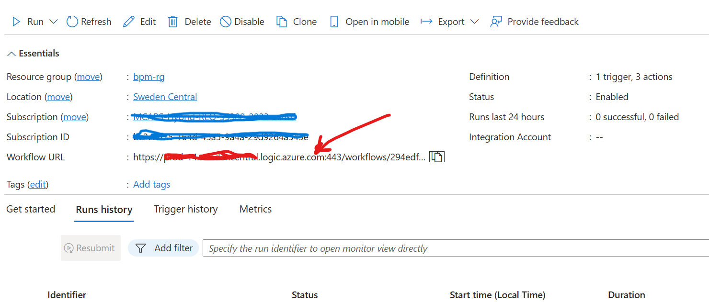

# P2P Anomaly Detection

This project implements an **Agentic system** for anomaly detection in the Procure to Pay (P2P) process, using the OpenAI Responses API with gpt-4o. The system analyzes invoice images, extracts relevant information, retrieves contract details, and identifies anomalies based on predefined business rules.

The key characteristics of this approach with the Responses API are:
- The client application makes a single call to the Responses API that internally handles all the actions autonomously, processes the information and returns the response. In other words, the client application does not have to perform those actions itself.
- These actions that the Responses API uses, are **Hosted tools** like (file search, vision based reasoning). 
- **Function calling** is used to invoke custom action not available in the Hosted tools (i.e. calling Azure Logic App in this case). The Responses API delegates control to the client application that executes the identified Function, hands over the response to the Responses API to complete the rest of the steps in the business process
- **Handling of state** across all the tool calls, and **orchestrating** them in the right sequence are all handled by the Responses API.
- It autonomously takes the output from each Tool call and uses it to prepare the request for the next call.

## Overview

The P2P Anomaly Detection system follows this workflow:

1. Processes purchase invoice images using computer vision capabilities of gpt-4o
2. Extracts critical information like Contract ID, Supplier ID, and line items
3. Retrieves corresponding contract details from an external system via Azure Logic App, through Function Calling capabilities in Responses API
4. Searches for the business rules in the OpenAI vector store, for detection of anomalies in Procure to Pay processes
5. Applies the Business rules on the Invoice details and validates them against the details in the Contract data, using gpt-4o for reasoning
6. Generates a detailed report of violations and anomalies using gpt-4o

## Key Features

- **Invoice Image Analysis**: Extracts structured data from invoice images
- **Contract Verification**: Retrieves and compares contract details with invoice data
- **Business Rules Enforcement**: Applies domain-specific rules for anomaly detection
- **Detailed Reporting**: Provides comprehensive analysis of detected anomalies

## Setup

1. Clone this repository
2. Install dependencies:

```sh
pip install -r requirements.txt
```
3. Create a `.env` file based on `.env_example`:

**Note:**  As of this writing, while the Responses API of OpenAI is announced in Azure, it is still not available. Hence, I have used the API from OpenAI directly.

```sh
api_key="your-openai-api-key" 
model="gpt-4o" 
logicapp_url="your-azure-logic-app-url" 
vector_store_id="your-vector-store-id"

```

4. Deploy pre requisites

a. **Vector Search Database:**
- Use the sample file [rules](./data_files/p2p-rules.txt) that contains sample business rules for procure to pay validation.
- Run the code in [python file](vector-store.py) to provision a Vector store and index the file above, for search. This is a turnkey capability provided by OpenAI to easily create a search-able vector database.

b. **Azure Logic App**
- Create an Azure Logic App that can be Triggered via a REST API call. The Logic App should implement a HTTP Request trigger, and have the last action as HTTP Response. 

Note: **All the actions in the Logic App must be configured to run synchronously.**

Refer to the documentation [here](https://learn.microsoft.com/en-us/azure/ai-services/openai/how-to/assistants-logic-apps) for more details.

In order to run this sample, create a Logic App similar to the one described below. Its URL needs to be added in the .env configuration of the Bot App. The Logic App takes the ContractID and SupplierID. It runs a T-SQL Query on the fly with these parameters on an Azure SQL Database, and returns the contract header and lines information. 

The Schema of the payload used in the HTTP Trigger is:

```json
{
    "properties": {
        "ContractID": {
            "type": "string"
        },
        "SupplierID": {
            "type": "string"
        }
    },
    "type": "object"
}

```

Here is a screenshot of the Logic App Flow:



The Logic App actions should have the asynchronous pattern disabled. See below:



For simplicity, I have used the entire HTTP Trigger URL, complete with the access token, and used that in the environment variable. After you have created the App, you can get this URL from the Azure Portal directly. See below:



The Logic App queries a Database View that joins the data across Contract Header and Contract Lines table. 

c. **Database :**
Azure SQL Database is used in this sample. The DB Script to create the database tables and View is provided [here](./data_files/db-sql.sql))

## Usage

Place your invoice images in the `data_files` directory and run:
The sample scanned Purchase Invoice documents used in the demo are in the [folder](./data_files/) folder.

The user prompt is set in the code directly

'here are the Purchase Invoice image(s) as input. Detect anomalies in the procure to pay process and give me a detailed report'


```python
python app.py
```


The system will process the images, extract information, retrieve contract details, and generate an anomaly report.

## Components

- **app.py**: Main application orchestrating the entire workflow
- **tools.py**: Custom function implementations for contract retrieval
- **config.py**: Configuration management using environment variables
- **vector-store.py**: Vector store creation and management for business rules
- **data_files/**: Contains invoice images and business rules text file

## Business Rules

The system checks for various anomalies including:
- Invoice dates outside contract validity period
- Contract status verification
- Invoice amounts exceeding contract values
- Currency mismatches
- Line item validation against contract specifications

## Requirements

- Python 3.12
- OpenAI API key
- Azure Logic App endpoint for contract data
- OpenAI vector store for business rules


## Demo Video

See a demo of this application [here](https://youtu.be/qYVijzwkncY)
